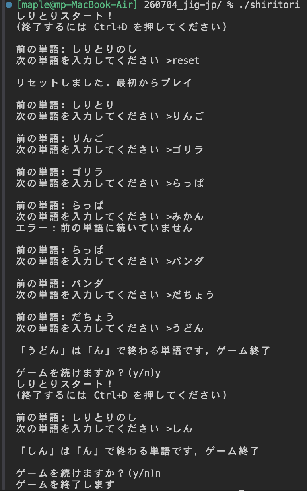

# jig.jp サマーインターンシップ2026 選考課題（SABERAコース）
作成者 maple (金沢大学融合学域スマート創成科学類B4)

## 概要
本リポジトリは、jig.jp サマーインターンシップ2026 の選考課題（SABERAコース）として作成した提出物です。

普段C言語にはあまり触れていないため、本課題は自身のC言語学習も兼ねて取り組みました。課題ページのステップに沿ってHello Worldから写経で基礎を固めつつ、そこに独自の追加機能を加える形で完成させています。

## ビルド方法と実行方法
`gcc shiritori.c -o shiritori && ./shiritori`
## 動作の様子が分かるスクリーンショット

## 実装した機能の詳細な説明

### 必須機能

**直前の単語の表示**
毎ターン、直前に使われた単語を「前の単語: ◯◯」として表示する。単語は履歴配列 `history` の末尾要素を参照している。

**任意の単語の入力**
`fgets` で標準入力から1行を受け取る。末尾の改行はしりとり判定の妨げになるため除去している。

**しりとりの成立判定（末尾と先頭の比較）**
直前の単語の末尾1文字と、入力された単語の先頭1文字を比較し、一致した場合のみ単語を更新する。一致しなければエラーを表示し、単語は更新しない。日本語はUTF-8で1文字3バイトのため、末尾3バイトと先頭3バイトを取り出して比較している。

**「ん」で終了**
入力された単語の末尾が「ん」（カタカナ「ン」を含む）の場合、ゲームを終了する。

**過去の単語で終了**
使用済みの単語を履歴に保持し、既出の単語が入力されたらゲームを終了する。

**リセット機能**
ゲーム中に `reset` と入力すると履歴を初期化して最初からやり直せる。さらにゲーム終了後には「ゲームを続けますか？(y/n)」と尋ね、`y` で再スタートできる。

### 追加機能

**1. 最初の単語のランダム化**
複数の候補から `rand()` で1つを選んで開始単語とする。

**2. ひらがな・カタカナ以外の入力を弾く**
入力のバイト列を3バイトずつ検査し、UTF-8のひらがな・カタカナの範囲（先頭バイトが `0xE3`、2バイト目が `0x81`〜`0x83`）に収まっているかを確認する。英数字や記号など範囲外の文字は再入力を促す。

**3. 二文字以上の単語のみ許可**
1文字（3バイト）だけの入力を弾き、2文字（6バイト）以上の単語のみ受け付ける。

**4. ひらがなとカタカナの同一視（あ＝ア）**
しりとりの成立判定と「ん」判定を、単純なバイト比較ではなく文字番号（コードポイント）の比較で行う。カタカナはひらがなとコードポイントが `0x60` ずれているだけなので、カタカナを検出したら `0x60` を引いてひらがなに正規化してから比較する。これにより「りんご → ゴリラ」のようにひらがなとカタカナをまたいでも繋がる。

## AIを使った場合、どのように活用したか

本課題は自身のC言語学習を主目的としたため、AI（Claude Opus4.8）には実装コードの生成を丸投げせず、主に補助的な用途で活用した。

- **C言語の基礎概念の学習**: `fgets`、`int`/`void`、`main` 関数、UTF-8における日本語のバイト構造、`srand` と `rand` の違い、入れ子関数がなぜ標準Cで使えないか、といった疑問を質問し、理解しながら実装を進めた。
- **エラー・警告の原因調査**: 括弧の対応ミス、`printf` の書式指定の警告、EOF時の無限ループ、macOSのclangで入れ子関数が使えない問題など、コンパイルエラーや警告の原因と直し方を相談した。
- **設計方針の相談**: 終了後に再プレイするための状態管理（フラグ変数）の考え方や、ひらがな・カタカナを同一視する方法（対応表を作るか、`0x60` オフセットで正規化するか）などの選択肢を相談した。

コードは基本的に自分で記述(写経)し、AIは概念の説明・エラーの原因特定・設計のレビュー役として利用した。

なお、実際のAIとのやり取りの全文は [ai-conversation-log.md](ai-conversation-log.md) に記録している。
